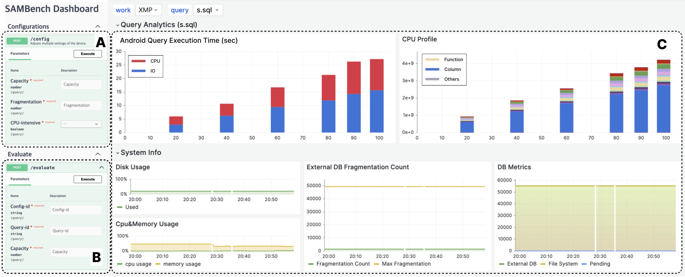

# SAMBench

Android 미디어 액세스를 위한 SQLite 벤치마크

## 소개

SAMBench는 직관적인 웹 기반 대시보드를 제공하며, Android 애플리케이션에서 수집한 미디어 액세스 쿼리를 활용하여 다양한 구성에서 미디어 액세스 성능을 평가할 수 있는 도구입니다.

SAMBench는 Android 환경에서 미디어 액세스에 초점을 맞춰 SQLite 데이터베이스 시스템의 성능을 분석하기 위해 설계된 종합적인 벤치마크 도구입니다. 한국외국어대학교와 삼성전자 연구진이 개발한 이 도구는 Android 시스템 내 SQLite 성능에 미치는 미디어 액세스의 영향을 이해하기 위한 공백을 채우기 위해 제작되었습니다. 실제 Android 애플리케이션에서 수집한 미디어 액세스 쿼리를 활용하여, SAMBench는 다양한 구성에서 성능을 평가할 수 있는 대화형 웹 기반 대시보드를 통해 세부적인 분석을 제공합니다.

## 저자

- 김지섭 (한국외국어대학교) - <0226daniel@hufs.ac.kr>
- 박세현 (한국외국어대학교) - <sarah1918@hufs.ac.kr>
- 전혜은 (삼성전자) - <hyeeun.jun@samsung.com>
- 이기성 (삼성전자) - <kiras.lee@samsung.com>
- 이우중 (삼성전자) - <woojoong.lee@samsung.com>
- 박종혁 (한국외국어대학교) - <jonghyeok.park@hufs.ac.kr>

## 특징

- **종합 분석**: Android 환경에서 미디어 파일이 데이터베이스 작업에 미치는 영향을 강조하며, SQLite의 미디어 액세스 처리 성능을 평가합니다.
- **대화형 대시보드**: 벤치마크 구성 관리, 쿼리 실행, 실시간 결과 분석을 위한 직관적인 웹 기반 대시보드를 제공합니다.
- **실제 애플리케이션 쿼리**: 대표적인 Android 애플리케이션의 미디어 액세스 쿼리를 통합하여 현실적인 벤치마크 환경을 제공합니다.

## 아키텍처

SAMBench는 웹 기반 대시보드와 벤치마크 백엔드의 두 가지 주요 구성 요소로 구성됩니다. 대시보드는 구성 관리, 쿼리 실행, 대화형 분석을 지원합니다. 백엔드는 API 요청을 처리하고, adb를 통해 Android 장치에서 명령을 실행하며, 성능 메트릭을 수집하여 분석에 활용합니다.



## 시작하기

### 호스트 머신의 사전 요구 사항

- Ubuntu `20.04.6 LTS`
- [nodejs](https://github.com/nvm-sh/nvm#installing-and-updating) `18.0.0`
- [docker](./docs/docker-install.md) `24.0.7`
- [adb](https://developer.android.com/tools/sdkmanager) `35.0.0-11411520`
- [fastboot](https://developer.android.com/tools/sdkmanager) `35.0.0-11411520`
- sqlite3 `3.45.2`

### Android 장치의 사전 요구 사항

- Android 버전 13 이상이 설치된 장치
- 루팅된 Android 장치가 필요

### 설치

1. 저장소 복제:

   ```sh
   git clone https://github.com/hufs-ids/sambench.git
   cd sambench
   ```

2. 환경 변수 수정:

   ```sh
   cp .env.example .env
   vim .env
   ```

3. 인프라 서비스 시작:

   ```sh
   docker compose up -d
   ```

4. API 서버 시작:

   ```sh
   cd api
   npm install -g yarn
   yarn install
   pm2 start yarn --name sambench -- start:dev --preserveWatchOutput
   ```

### 설정

1. 환경 설정

   아래 링크를 방문하여 API를 실행하세요.

   <http://localhost:3000/api>

   ```plaintext
   PUT /setup/storage/generate-batch
   PUT /setup/storage/push-scripts
   PUT /setup/storage/push-query
   ```

2. 호스트 SQLite 설정

   Makefile을 수정하여 CFLAGS에 다음을 추가하세요:

   ```plaintext
   CFLAGS =   -DVDBE_PROFILE -DSQLITE_DEBUG -DSQLITE_PERFORMANCE_TRACE
   ```

3. Grafana에 로그인

   <http://localhost:3001>

4. 대시보드 실행

   <http://localhost:3002>

### 사용법

- **구성 관리**: 대시보드를 사용하여 미디어 파일 유형, 시스템 부하 등 벤치마크 구성을 설정합니다.
- **쿼리 실행**: Android 장치에서 미디어 액세스 쿼리를 실행하며, 조건과 구성을 변경할 수 있습니다.
- **대화형 분석**: 대시보드를 통해 벤치마크 결과를 분석하고, 다양한 구성을 비교합니다.

## 시연

SAMBench는 Google Pixel 7을 사용하여 시연되었으며, 미디어 파일 유형 및 스토리지 단편화와 같은 다양한 조건에서 SQLite의 성능을 평가할 수 있는 현실적인 실험 환경을 구축하는 데 능력을 보여주었습니다.

## 라이선스

이 작업은 MIT 라이선스에 따라 라이선스가 부여됩니다. 자세한 내용은 [LICENSE](LICENSE)를 참조하세요.

## 감사의 글

- 이 프로젝트는 한국외국어대학교와 삼성전자의 협력 연구를 통해 이루어졌습니다.
- 모든 기여자와 오픈소스 커뮤니티에 감사드립니다.

## 문의

문의 사항은 제공된 이메일 주소를 통해 저자에게 연락하시기 바랍니다.
